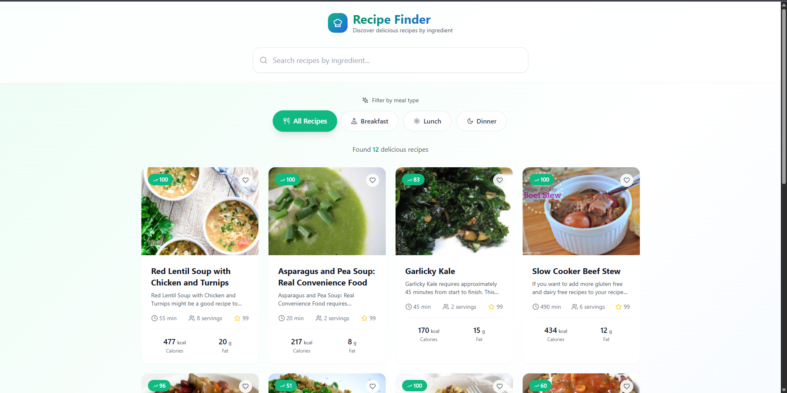

# Recipe Finder App

A modern, responsive recipe discovery application built with React, TypeScript, and Tailwind CSS. Search for recipes by ingredients using the Spoonacular API with real-time autocomplete, detailed nutritional information, and beautiful UI animations.



## ✨ Features

### 🔍 Smart Search
- **Ingredient-based search** with real-time results
- **Autocomplete suggestions** powered by Spoonacular API
- **Debounced search** for optimal performance
- **Clear search** functionality with one click

### 🍽️ Recipe Discovery
- **Category filtering** (All, Breakfast, Lunch, Dinner)
- **Recipe cards** with hover animations and micro-interactions
- **Nutritional badges** showing health scores
- **Favorite recipes** with heart icon toggle
- **Responsive grid layout** (1-4 columns based on screen size)

### 📊 Detailed Information
- **Full recipe modal** with large, readable layout
- **Complete ingredient lists** with measurements
- **Step-by-step cooking instructions**
- **Comprehensive nutritional data** with visual breakdowns
- **Cooking time and serving information**
- **Health and popularity scores**

### 🎨 Modern Design
- **Beautiful gradient backgrounds** and smooth animations
- **Apple-level design aesthetics** with attention to detail
- **Responsive design** optimized for all devices
- **Loading states** with skeleton animations
- **Error handling** with graceful fallbacks

## 🚀 Quick Start

### Prerequisites
- Node.js 18+ 
- npm or yarn
- Spoonacular API key (get one at [spoonacular.com](https://spoonacular.com/food-api))

### Installation

1. **Clone the repository**
   ```bash
   git clone <repository-url>
   cd recipe-finder-app
   ```

2. **Install dependencies**
   ```bash
   npm install
   ```

3. **Start the development server**
   ```bash
   npm run dev
   ```

4. **Open your browser**
   Navigate to `http://localhost:5173`

## 🔧 Configuration

### API Setup
The app uses the Spoonacular API for real recipe data. The API key is already configured in the code:

```typescript
// src/services/api.ts
const API_KEY = 'API Key here';
```

### API Endpoints Used
- **Recipe Search**: `/recipes/complexSearch` - Search recipes by ingredients
- **Autocomplete**: `/food/ingredients/autocomplete` - Get ingredient suggestions
- **Recipe Details**: `/recipes/{id}/information` - Get detailed recipe information

### Fallback System
If the API is unavailable, the app gracefully falls back to mock data to ensure functionality.

## 🏗️ Project Structure

```
src/
├── components/           # React components
│   ├── SearchBar.tsx    # Search input with autocomplete
│   ├── CategoryFilter.tsx # Meal type filter buttons
│   ├── RecipeCard.tsx   # Individual recipe card
│   ├── RecipeGrid.tsx   # Recipe grid layout
│   ├── RecipeModal.tsx  # Recipe details modal
│   └── NutritionInfo.tsx # Nutritional information display
├── services/            # API services
│   └── api.ts          # Spoonacular API integration
├── types/              # TypeScript type definitions
│   └── recipe.ts       # Recipe and nutrition interfaces
├── App.tsx             # Main application component
├── main.tsx           # Application entry point
└── index.css          # Global styles and Tailwind imports
```

## 🎯 Key Components

### SearchBar
- Real-time ingredient autocomplete
- Debounced API calls for performance
- Keyboard navigation support
- Clear search functionality

### RecipeCard
- Hover animations and micro-interactions
- Nutritional badges and health scores
- Favorite toggle functionality
- Responsive image loading

### RecipeModal
- Large, readable layout (max-width: 6xl)
- Comprehensive recipe information
- Nutritional breakdown with visual charts
- Smooth open/close animations

### CategoryFilter
- Meal type filtering (Breakfast, Lunch, Dinner)
- Active state styling
- Smooth transitions

## 🔍 API Integration

### Search Recipes
```typescript
const searchRecipes = async (filters: SearchFilters): Promise<Recipe[]>
```
- Searches recipes by ingredients
- Supports meal type filtering
- Returns detailed recipe information with nutrition data

### Ingredient Autocomplete
```typescript
const getIngredientAutocomplete = async (query: string): Promise<AutocompleteIngredient[]>
```
- Provides ingredient suggestions as user types
- Debounced for optimal performance
- Returns ingredient names and images

### Recipe Details
```typescript
const getRecipeDetails = async (id: number): Promise<Recipe>
```
- Fetches complete recipe information
- Includes cooking instructions and ingredient lists
- Returns comprehensive nutritional data

## 🎨 Design System

### Colors
- **Primary**: Emerald (#10B981) - Main brand color
- **Secondary**: Blue (#3B82F6) - Accent and gradients
- **Success**: Green (#22C55E) - Positive actions
- **Warning**: Orange (#F97316) - Attention elements
- **Error**: Red (#EF4444) - Error states
- **Neutral**: Gray scale for text and backgrounds

### Typography
- **Headings**: Inter font family, multiple weights
- **Body**: Optimized line heights (150% body, 120% headings)
- **Hierarchy**: Clear size progression (text-4xl → text-lg)

### Spacing
- **8px grid system** for consistent spacing
- **Responsive padding** and margins
- **Proper alignment** throughout the interface

## 📱 Responsive Design

### Breakpoints
- **Mobile**: 1 column grid, stacked navigation
- **Tablet**: 2 column grid, horizontal filters
- **Desktop**: 3-4 column grid, full layout
- **Large**: 4+ column grid, maximum content width

### Features
- **Responsive images** with proper aspect ratios
- **Touch-friendly** buttons and interactions
- **Optimized typography** for all screen sizes
- **Adaptive layouts** that work on any device

## 🚀 Performance

### Optimizations
- **Debounced search** to reduce API calls
- **Image lazy loading** for better performance
- **Component memoization** where appropriate
- **Efficient re-renders** with proper key props

### Loading States
- **Skeleton animations** during data fetching
- **Progressive image loading** with fade-in effects
- **Smooth transitions** between states

## 🛠️ Development

### Available Scripts
- `npm run dev` - Start development server
- `npm run build` - Build for production
- `npm run preview` - Preview production build
- `npm run lint` - Run ESLint

### Tech Stack
- **React 18** - UI library with hooks
- **TypeScript** - Type safety and better DX
- **Tailwind CSS** - Utility-first styling
- **Vite** - Fast build tool and dev server
- **Lucide React** - Beautiful icon library

### Code Quality
- **ESLint** configuration for code quality
- **TypeScript** for type safety
- **Proper component structure** with clear separation
- **Consistent naming conventions**

## 🌟 Features in Detail

### Search Experience
The search functionality provides an intuitive experience with real-time suggestions and smart filtering. Users can search by ingredients and get relevant recipes instantly.

### Visual Design
The app features a modern design with smooth animations, proper spacing, and a cohesive color scheme that creates an engaging user experience.

### Nutritional Information
Comprehensive nutritional data is displayed in an easy-to-understand format with visual charts and daily value percentages.

### Recipe Details
Each recipe opens in a large, readable modal with complete cooking instructions, ingredient lists, and nutritional breakdowns.

## 🤝 Contributing

Contributions are welcome! Please feel free to submit a Pull Request.

## 📞 Support

If you have any questions or need help with the app, please open an issue in the repository.

---

**Built with ❤️ using React, TypeScript, and Tailwind CSS**